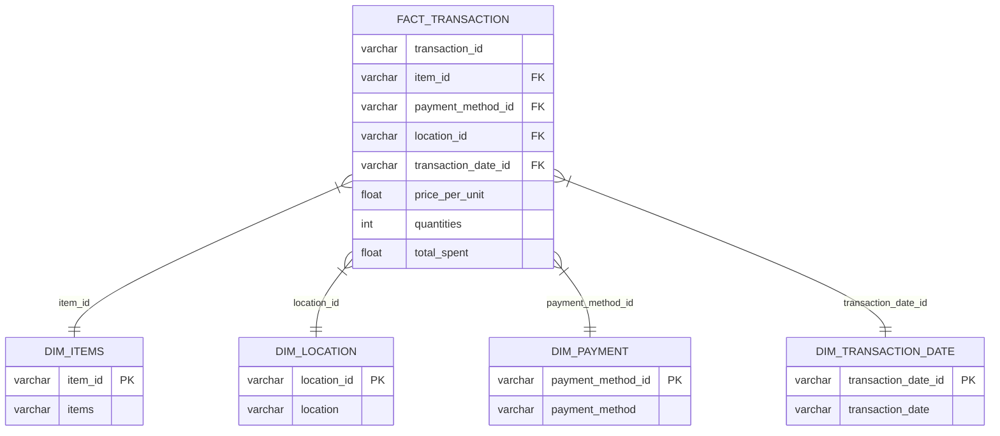

# ETL_SimplePipeline

This ETL pipeline uses Snowflake for data storage, dbt for cleaning and transforming data, and Power BI for dashboards.

This ETL is based on cafe-store data. We have columns: 'TRANSACTION_ID', 'ITEMS', 'PRICE_PER_UNIT', 'QUANTITIES', 'TOTAL_SPENT', 'PAYMENT_METHOD', 'LOCATION', 'TRANSACTION_DATE'.

The star schema:

PowerBI Dashboards:

.png)

How's done:
Initial data:

Data info:

We can restore some data. For example:

We have some unique prices, like salad and tea. Both have distinct price. We can restore ERROR and UNKNOWN atributes base on that.

Also we can restore quantities, price_per_unit and total_spent if we have atleast two of them not null.

At the final we have:

Location, Payment-method and transaction_date will remain unknown, because is imposible to restore this kind of data.

Medalion arhitecture (Snowflake):

PowerBI dashboard:
